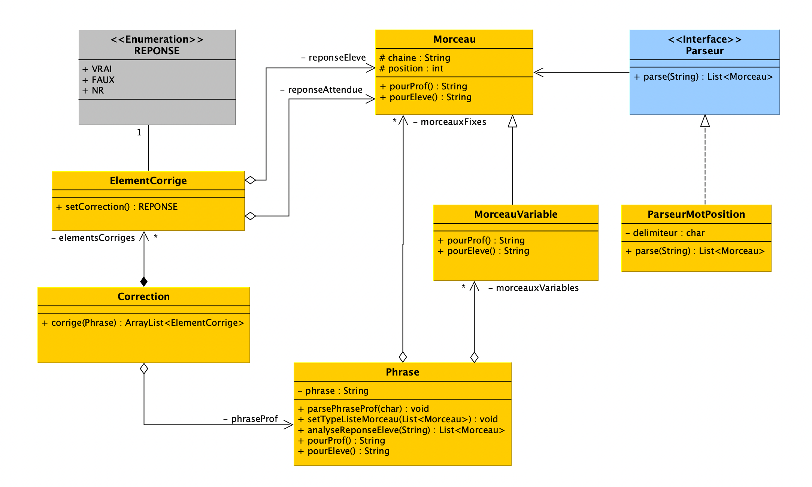

# LanguageLearningApp

Dans le cadre du cours Programmation Objet Java de Master 2 Traitement Automatique des Langues, nous allons construire une application qui permettra de répondre aux besoins suivants :
- de s’exercer aux langues orientales et non orientales !
- de permettre aux professeurs d’y enregistrer leurs exercices
- de permettre aux élèves de faire les exercices proposés selon leurs niveaux de corriger automatiquement l’exercice proposé.

Les approches techniques seront améliorées au fur et à mesure des séances :
- formatage des fichiers en XML
- mise sous forme de webservice
- utilisation d’une base documentaire
- autres nouveaux exercices

 

### NB: Rappel sur les collections
|NOM|ORDONNÉE|DOUBLONS|ACCÈS DIRECT|VALEURS NULLES|THREAD-SAFE|
|:--:|:--:|:--:|:--:|:--:|:--:|
|**ArrayDeque**|❌|✔|❌|❌|❌|
|**ArrayDeque**|✔|✔|❌|❌|❌|
|**ArrayList**|✔|✔|✔|✔|❌|
|**HashMap**|❌|❌|✔|✔|❌|
|**LinkedList**|✔|✔|❌|✔|❌|
|**PriorityQueue**|✔|✔|❌|❌|❌|
|**Stack**|✔|✔|❌|✔|✔|
|**TreeMap**|✔|❌|✔|❌|❌|
|**TreeSet**|✔|❌|❌|❌|❌|
|**Vector**|✔|✔|✔|✔|✔|
